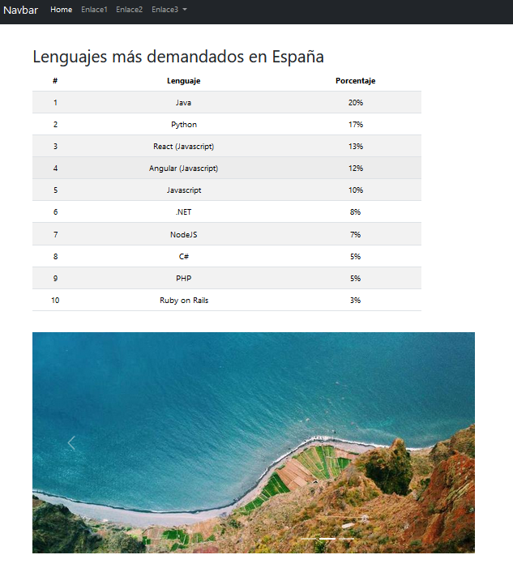
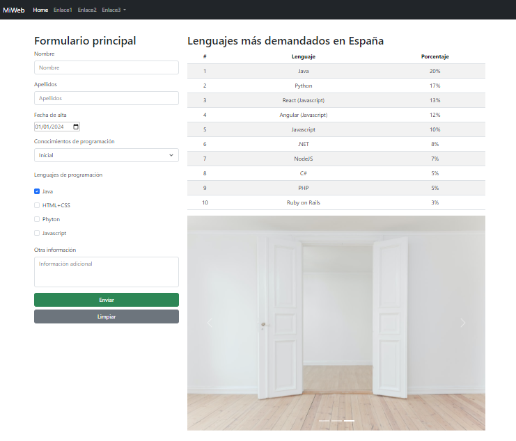

# Práctica 5.2 Página web en Bootstrap

## Parte 1

Crea tu propia página web con los elementos de Bootstrap y que tenga al menos los siguientes elementos:
-   Una **barra de navegación** o *navbar* con varios enlaces y al menos un desplegable.
-   Un lenguaje de diseño coherente con lo que hemos visto hasta ahora.
-   Un contenedor principal que tenga los siguientes elementos:
    - Una **tabla** formateada en Bootstrap con datos y al menos 10 entradas.
    - Un carrusel de **imágenes**, galería, o similar, con imágenes generadas aleatoriamente de tamaño reducido (200x200).
    - Una fila con tres columnas que describan diferentes servicios o características de tu web. Cada columna debe incluir un icono (puedes usar Bootstrap Icons), un título y una breve descripción.
    - Incluye una hoja de estilos CSS adicional para modificar varios elementos de tu diseño.
    - Cualquier otro elemento de Bootstrap que quieras añadir y que sea coherente con la temática de tu página.

## Parte 2

Mejora la página anterior para que el contenedor principal ahora tenga al menos **dos columnas**:
- Diseñar el comportamiento del contenedor para que sea Responsive.
- En una de ellas habrá un **formulario** principal con al menos 6 elementos de formulario (distintos campos de entrada, controles, checks..)
- Deberá de hacerse una validación básica de los elementos del formulario utilizando el estándar de HTML5.

## Valoración y testing

Se valorará:
- La utilización de componentes variados de Bootstrap.
- La adaptabilidad a diferentes tamaños de pantalla.
- La estética general y funcionalidad de la página.
- Agregar una tabla de pruebas en la validación de los elementos del formulario.
