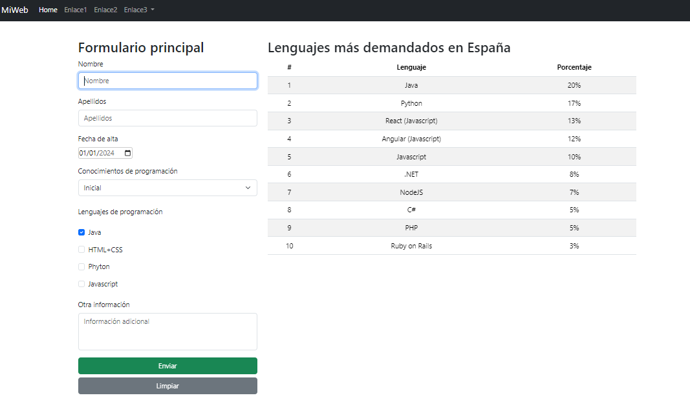

# Práctica 5.2 Página en Bootstrap

Crea una página web como en el diseño que tenga al menos los siguientes elementos:
-   Una **barra de navegación** o *navbar* con varios enlaces y al menos un desplegable.
-   Un contenedor principal que tenga los siguientes elementos en **dos columnas**:
    -   Un **formulario** principal con al menos 6 elementos de formulario y una validación básica de éstos usando el estándar de HTML5.
    -   Una **tabla** formateada en Bootstrap con datos y al menos 10 entradas.

